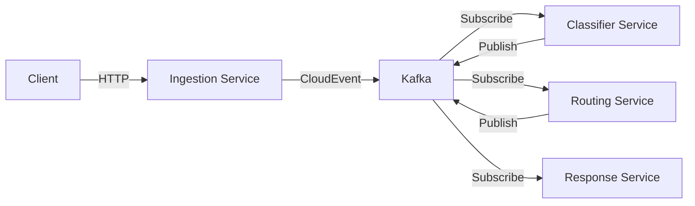

# DIP - Deno Intelligence Platform

[](https://deno.land)
[](https://www.typescriptlang.org/)
[](https://cloudevents.io/)
[](LICENSE)
[](CONTRIBUTING.md)

## 🚀 What is DIP?

DIP (Deno Intelligence Platform) is a modern, high-performance event-driven
microservices platform built with Deno. It provides a robust foundation for
building intelligent, scalable systems that process and respond to events in
real-time.

Originally inspired by enterprise ticketing systems, DIP has evolved into a
flexible platform suitable for any event-driven architecture—from customer
service automation to IoT data processing, from real-time analytics to workflow
orchestration.

## ✨ Key Features

### 🦕 **Deno-First Architecture**

- Native TypeScript support with zero build configuration
- Secure by default with explicit permission model
- Built-in tooling for testing, formatting, and benchmarking
- Lightning-fast startup times (<500ms per service)

### 🔄 **Event-Driven with CloudEvents**

- Industry-standard CloudEvents specification
- Type-safe event handling with Zod validation
- Built-in event correlation and causation tracking
- Kafka-based messaging for reliable event delivery

### ⚡ **Modern Web Framework (Hono)**

- Ultra-fast HTTP routing and middleware
- Works everywhere: Deno, Node.js, Bun, Edge
- Excellent TypeScript inference
- Express-like simplicity with modern features

### 🛡️ **Runtime Validation (Zod)**

- Schema validation with automatic TypeScript type inference
- Composable schemas for complex data structures
- Transform and parse data in a single step
- Comprehensive error messages for debugging

### 🧪 **Comprehensive Testing**

- Built-in evaluation framework using Deno.test
- Performance benchmarking with Deno.bench
- Integration testing with real event flows
- Comparison metrics against other platforms

## 🏃 Quick Start

Get your first DIP service running in under 5 minutes!

### Prerequisites

- [Docker](https://www.docker.com/get-started) (for infrastructure)
- [VS Code](https://code.visualstudio.com/) (recommended)
- Git

### Option 1: Using DevContainer (Recommended)

1. Clone the repository:

```bash
git clone https://github.com/ncolesummers/dip.git
cd dip
```

2. Open in VS Code:

```bash
code .
```

3. When prompted, click "Reopen in Container" (or use Command Palette:
   `Remote-Containers: Reopen in Container`)

4. Start the infrastructure:

```bash
docker compose up -d
```

5. Run your first service:

```bash
deno task dev:ingestion
```

### Option 2: Local Installation

1. Install Deno:

```bash
curl -fsSL https://deno.land/install.sh | sh
```

2. Clone and setup:

```bash
git clone https://github.com/ncolesummers/dip.git
cd dip
docker compose up -d
```

3. Run the ingestion service:

```bash
deno run --allow-net --allow-env services/ingestion/main.ts
```

### Verify It's Working

```bash
# Check service health
curl http://localhost:8001/health

# Send a test event
curl -X POST http://localhost:8001/api/tickets \
  -H "Content-Type: application/json" \
  -d '{"text": "Hello DIP!", "priority": "medium"}'
```

## 🏗️ Architecture Overview

DIP follows a microservices architecture where each service:

- Subscribes to specific CloudEvents topics
- Processes events according to its domain logic
- Publishes new events for downstream services
- Exposes HTTP endpoints via Hono for external interaction



For detailed architecture documentation, see
[docs/ARCHITECTURE.md](docs/ARCHITECTURE.md).

## 🛠️ Development

### Project Structure

```
dip/
├── .devcontainer/          # VS Code dev container configuration
├── shared/                 # Shared libraries and utilities
│   ├── events/            # CloudEvents abstractions
│   ├── schemas/           # Zod validation schemas
│   └── services/          # Base service classes
├── services/              # Microservices
│   ├── ingestion/         # HTTP ingestion service
│   ├── classifier/        # Intent classification service
│   └── ...               # Additional services
├── tests/                 # Test suites
│   ├── unit/             # Unit tests
│   ├── integration/      # Integration tests
│   └── evals/            # Evaluation suites
└── scripts/              # Development tools
```

### Common Commands

```bash
# Start development environment
deno task dev

# Run all tests
deno test --allow-all

# Run evaluations
deno test tests/evals/ --allow-all

# Run benchmarks
deno bench --allow-all

# Type check
deno check **/*.ts

# Format code
deno fmt

# Lint code
deno lint

# Generate a new service
deno run --allow-all scripts/generate-service.ts --name my-service
```

### Creating a New Service

1. Use the service generator:

```bash
deno run --allow-all scripts/generate-service.ts --name my-service
```

2. Implement your service logic:

```typescript
// services/my-service/service.ts
import { BaseService } from "../../shared/services/base.ts";

export class MyService extends BaseService {
  async processEvent(event: CloudEvent): Promise<void> {
    // Your logic here
  }
}
```

3. Define your schemas:

```typescript
// services/my-service/schemas.ts
import { z } from "zod";

export const MyDataSchema = z.object({
  // Your schema definition
});
```

4. Run your service:

```bash
deno task dev:my-service
```

## 🤝 Contributing

We welcome contributions from developers of all experience levels! Whether
you're fixing a typo, adding a feature, or proposing a major architectural
change, your input is valuable.

Please see our [Contributing Guide](CONTRIBUTING.md) for details on:

- Setting up your development environment
- Finding good first issues
- Our pull request process
- Code style guidelines
- Testing requirements

## 📚 Documentation

- [Architecture Guide](docs/ARCHITECTURE.md) - System design and patterns
- [API Reference](docs/API.md) - Service endpoints and events
- [Deployment Guide](docs/DEPLOYMENT.md) - Production deployment instructions
- [Troubleshooting](docs/TROUBLESHOOTING.md) - Common issues and solutions

## 🔒 Security

Security is a top priority for DIP. We leverage Deno's security model and
implement additional measures:

- Explicit permission model for all services
- Runtime validation of all external inputs
- CloudEvents signature verification
- Regular security updates and audits

For security concerns, please see our [Security Policy](.github/SECURITY.md).

## 📊 Performance

DIP is designed for high performance and low resource usage:

- **Startup Time**: <500ms per service
- **Memory Usage**: <50MB per service at idle
- **Event Throughput**: >1000 events/second per service
- **Validation Speed**: <1ms per event with Zod

See [benchmarks/](benchmarks/) for detailed performance comparisons.

## 🗺️ Roadmap

### Current Version: v0.1.0 (Foundation)

- ✅ Core infrastructure with TypedCloudEvents
- ✅ BaseService abstract class
- ✅ Kafka integration layer
- ✅ DevContainer setup

### Upcoming: v0.2.0 (Service Migration)

- 🚧 Complete service suite migration
- 🚧 Health check standardization
- 🚧 Structured logging implementation

### Future: v0.3.0 (Evaluation Framework)

- 📋 Comprehensive evaluation suites
- 📋 Performance benchmarking
- 📋 Comparison with Python baseline

See our [Project Board](https://github.com/ncolesummers/dip/projects) for
detailed progress.

## 📄 License

DIP is open source software [licensed as MIT](LICENSE).

## 🙏 Acknowledgments

DIP stands on the shoulders of giants:

- [Deno](https://deno.land) - The secure TypeScript runtime
- [Hono](https://hono.dev) - The ultrafast web framework
- [Zod](https://zod.dev) - TypeScript-first schema validation
- [CloudEvents](https://cloudevents.io) - The event data specification

## 💬 Community

- **GitHub Discussions**:
  [Ask questions and share ideas](https://github.com/ncolesummers/dip/discussions)
- **Issues**:
  [Report bugs or request features](https://github.com/ncolesummers/dip/issues)
- **Twitter**: Follow [@ncolesummers](https://twitter.com/ncolesummers) for
  updates
- **Code of Conduct**: Please review our [Code of Conduct](CODE_OF_CONDUCT.md)

---

Built with ❤️ by the DIP community. Happy coding! 🦕
