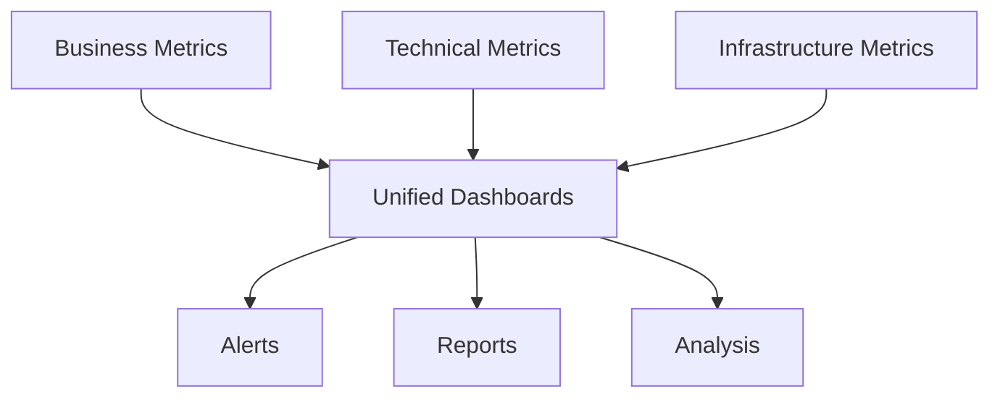
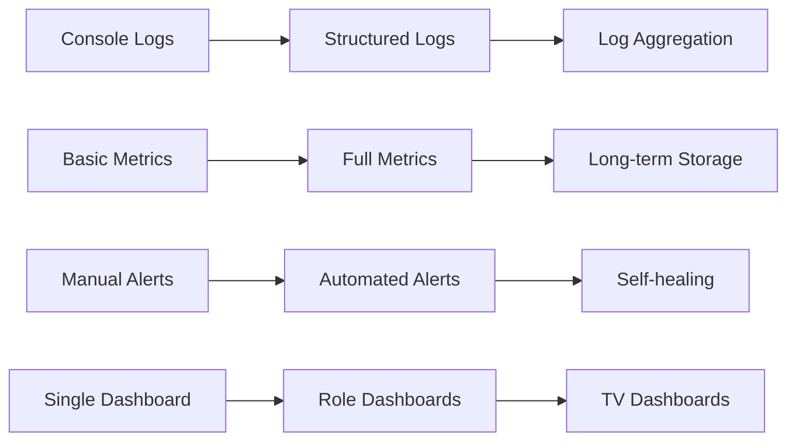

# Monitoring Strategy for DIP (Deno Intelligence Platform)

## Overview

This document outlines a comprehensive monitoring approach for the Deno Intelligence Platform, designed to be cost-effective for an open-source project while providing professional-grade observability. The strategy emphasizes pragmatic choices that balance capability with complexity.

---

## Monitoring Philosophy

### Core Tenets

1. **Start Simple, Evolve Gradually**: Basic metrics first, advanced later
2. **Open Source First**: Prefer open-source tools over proprietary
3. **Cost Conscious**: Free tiers and self-hosted where possible
4. **Developer Friendly**: Easy to understand and extend
5. **Production Ready**: Can scale from MVP to enterprise

### What We Monitor



---

## Tool Selection

### Recommended Stack for MVP

#### Metrics: Prometheus + Grafana Cloud Free

**Why This Choice:**
- **Prometheus**: Already integrated (see metrics.ts)
- **Grafana Cloud Free**: 10,000 series, 14-day retention
- **Cost**: $0 for MVP, scales to ~$50/month
- **Migration Path**: Easy to self-host later

**Configuration Approach:**
```yaml
# Remote write to Grafana Cloud
prometheus:
  remote_write:
    - url: https://prometheus-us-central1.grafana.net/api/prom/push
      basic_auth:
        username: <instance-id>
        password: <api-key>
      write_relabel_configs:
        # Only send important metrics to cloud
        - source_labels: [__name__]
          regex: '(up|http_.*|events_.*|tickets_.*)'
          action: keep
```

#### Logging: Console JSON + Loki (Future)

**Phase 1 (MVP):**
```typescript
// Structured JSON logging to stdout
console.log(JSON.stringify({
  timestamp: new Date().toISOString(),
  level: "info",
  service: "ingestion",
  trace_id: "abc123",
  message: "Ticket processed",
  ticket_id: "TKT-001",
  duration_ms: 145
}));
```

**Phase 2 (Growth):**
- Add Loki for log aggregation
- Grafana for log visualization
- Cost: ~$20/month for 50GB

#### Tracing: OpenTelemetry + Jaeger

**Why This Choice:**
- **OpenTelemetry**: Vendor-neutral, future-proof
- **Jaeger**: Free, easy to run, good enough for MVP
- **Alternative**: Grafana Tempo when scaling

**Implementation:**
```typescript
// Basic OpenTelemetry setup
import { trace } from '@opentelemetry/api';

const tracer = trace.getTracer('dip-service');
const span = tracer.startSpan('process-ticket');
// ... processing logic
span.end();
```

#### Error Tracking: Sentry Open Source

**Why This Choice:**
- **Self-hosted option**: Free and private
- **Great developer experience**: Excellent error grouping
- **Deno support**: Official SDK available
- **Alternative**: Grafana Cloud Errors (when available)

---

## Dashboard Strategy

### Audience-Specific Dashboards

#### 1. Developer Dashboard (Primary Audience)

**Purpose**: Day-to-day development and debugging

**Key Panels:**
- Service health status grid (red/yellow/green)
- Recent deployments timeline
- Error rate by service (last hour)
- Slowest endpoints (p95 latency)
- Active alerts
- Recent error samples with stack traces

**Update Frequency**: 30 seconds
**Time Range**: Last 3 hours default

#### 2. Operations Dashboard

**Purpose**: System health and performance monitoring

**Key Panels:**
- Golden signals overview (all services)
- SLO burn-down charts
- Resource utilization (CPU, memory, disk)
- Kafka lag by topic
- Database connection pool status
- Network I/O rates

**Update Frequency**: 1 minute
**Time Range**: Last 24 hours default

#### 3. Business Dashboard

**Purpose**: Product metrics and user activity

**Key Panels:**
- Tickets created/resolved (hourly)
- Classification distribution (intent types)
- Auto-resolution rate trend
- User satisfaction metrics (if available)
- Top error messages seen by users
- Geographic distribution (if applicable)

**Update Frequency**: 5 minutes
**Time Range**: Last 7 days default

#### 4. On-Call Dashboard

**Purpose**: Incident response and triage

**Key Panels:**
- Alert status (firing, pending, resolved)
- Service dependencies map
- Recent changes (deployments, configs)
- Anomaly detection highlights
- Runbook links for active alerts
- Contact information for escalation

**Update Frequency**: 10 seconds
**Time Range**: Last 1 hour default

### Dashboard Design Principles

```yaml
Glanceability:
  - Critical info visible in 5 seconds
  - Color coding: red=bad, yellow=warning, green=good
  - Large, readable fonts
  - No scrolling for key metrics

Context:
  - Include normal ranges
  - Show week-over-week comparisons
  - Annotate deployments and incidents
  - Link to relevant documentation

Actionability:
  - Each panel answers a specific question
  - Include "what to do" in panel descriptions
  - Link to runbooks for problem resolution
  - Drill-down capability to details
```

---

## Alert Routing Strategy

### Alert Channels by Environment

#### Development Environment
```yaml
Channels:
  - Console logs (all alerts)
  - Developer Slack channel (critical only)
  - No paging

Suppression:
  - Business hours only
  - Maintenance windows auto-detected
  - Batch similar alerts (5-minute window)
```

#### Staging Environment
```yaml
Channels:
  - Email to dev team list
  - Slack #staging-alerts channel
  - Dashboard annotations

Escalation:
  - No escalation in staging
  - Weekly summary report
```

#### Production Environment (Future)
```yaml
Primary:
  - PagerDuty or Opsgenie (free tier)
  - Slack #production-alerts
  - Email to on-call

Escalation Path:
  1. On-call engineer (0 minutes)
  2. Backup on-call (15 minutes)
  3. Team lead (30 minutes)
  4. Incident commander (45 minutes)

Integration:
  - Auto-create tickets for incidents
  - Update status page
  - Post-mortem tracking
```

### Alert Routing Rules

```typescript
// Conceptual routing logic
function routeAlert(alert: Alert) {
  if (alert.severity === 'critical' && env === 'production') {
    return ['pagerduty', 'slack-urgent', 'email'];
  }
  
  if (alert.severity === 'warning') {
    return ['slack-monitoring', 'email-daily-digest'];
  }
  
  if (alert.labels.service === 'experimental') {
    return ['slack-dev-only'];
  }
  
  return ['dashboard-only'];
}
```

---

## Minimum Viable Monitoring

### Day 1 Requirements (Must Have)

```yaml
Metrics:
  - Service up/down status
  - Request rate and errors
  - Basic latency (p50, p95)
  - Memory and CPU usage

Dashboards:
  - Single system overview
  - Per-service health

Alerts:
  - Service down
  - High error rate (>5%)
  - Out of memory

Tools:
  - Prometheus (built-in)
  - Grafana Cloud Free
  - Console logging
```

### Week 1 Additions

```yaml
Metrics:
  - Event processing rates
  - Kafka consumer lag
  - Database query performance
  - HTTP endpoint breakdown

Dashboards:
  - SLO tracking
  - Business metrics
  - Kafka overview

Alerts:
  - SLO violations
  - Queue backing up
  - Slow queries

Tools:
  - Basic distributed tracing
  - Error grouping
```

### Month 1 Enhancements

```yaml
Metrics:
  - Full percentiles (p99, p99.9)
  - Custom business metrics
  - Dependency health
  - Cost tracking

Dashboards:
  - On-call dashboard
  - Capacity planning
  - Cost analysis

Alerts:
  - Predictive alerts
  - Anomaly detection
  - Business metric alerts

Tools:
  - Log aggregation (Loki)
  - Full tracing (Jaeger)
  - Automated reports
```

---

## Implementation Guide

### Phase 1: Foundation (Week 1)

#### Tasks:
1. **Set up Grafana Cloud Free account**
   ```bash
   # Configure remote write
   deno run --allow-env setup-monitoring.ts
   ```

2. **Create basic dashboards**
   - Import from templates
   - Customize for DIP services
   - Set up variables for filtering

3. **Configure initial alerts**
   - Service health checks
   - High error rates
   - Memory limits

4. **Document access procedures**
   - How to access dashboards
   - How to acknowledge alerts
   - Who to contact for issues

### Phase 2: Enrichment (Week 2-4)

#### Tasks:
1. **Add distributed tracing**
   ```typescript
   // Instrument key operations
   import { instrumentService } from './shared/observability/tracing.ts';
   ```

2. **Implement custom metrics**
   - Business-specific counters
   - SLI measurements
   - Cost tracking metrics

3. **Create runbooks**
   - One per alert
   - Clear resolution steps
   - Contact information

4. **Set up log aggregation**
   - Deploy Loki
   - Configure log shipping
   - Create log dashboards

### Phase 3: Optimization (Month 2-3)

#### Tasks:
1. **Tune alerts based on data**
   - Adjust thresholds
   - Reduce false positives
   - Add missing coverage

2. **Optimize dashboard performance**
   - Use recording rules
   - Optimize queries
   - Cache where possible

3. **Implement automation**
   - Auto-remediation for known issues
   - Automated reports
   - Capacity planning scripts

4. **Add advanced monitoring**
   - Synthetic monitoring
   - Real user monitoring
   - Chaos engineering readiness

---

## Cost Management

### Estimated Costs by Stage

#### MVP (0-6 months)
```yaml
Grafana Cloud Free: $0
Jaeger (self-hosted): $0
Sentry (self-hosted): $0
Total: $0/month
```

#### Growth (6-12 months)
```yaml
Grafana Cloud Pro: $50/month
Loki (logs): $20/month
Additional storage: $10/month
Total: $80/month
```

#### Scale (12+ months)
```yaml
Self-hosted stack: $200/month (infrastructure)
Or Managed services: $300-500/month
Redundancy: +50%
Total: $300-750/month
```

### Cost Optimization Strategies

1. **Metrics Cardinality Control**
   ```typescript
   // Limit label combinations
   const labels = {
     service: serviceName,
     method: httpMethod,
     // Don't include: user_id, request_id, etc.
   };
   ```

2. **Sampling Strategies**
   ```typescript
   // Sample traces (not all requests)
   const shouldTrace = Math.random() < 0.01; // 1% sampling
   ```

3. **Retention Policies**
   ```yaml
   Metrics:
     Raw: 15 days
     5-minute: 30 days
     1-hour: 90 days
     1-day: 1 year
   
   Logs:
     Debug: 1 day
     Info: 7 days
     Error: 30 days
   ```

---

## Monitoring Governance

### Ownership Model

```yaml
Service Teams:
  - Own service-specific dashboards
  - Define service SLIs/SLOs
  - Create service alerts
  - Maintain runbooks

Platform Team:
  - Own infrastructure monitoring
  - Maintain monitoring tools
  - Define standards and practices
  - Provide training and support

On-Call Rotation:
  - Respond to alerts
  - Perform initial triage
  - Escalate when needed
  - Update runbooks post-incident
```

### Review Processes

#### Weekly
- Review alert noise (false positives)
- Check dashboard usage statistics
- Update on-call handoff notes

#### Monthly
- SLO review meeting
- Alert threshold tuning
- Dashboard cleanup
- Cost review

#### Quarterly
- Tool evaluation
- Architecture review
- Training needs assessment
- Strategy adjustment

---

## Migration Paths

### From MVP to Production



### Tool Migration Options

#### When to Migrate from Free Tier
- Hitting rate limits regularly
- Need longer retention
- Require advanced features
- Team size > 5 developers

#### Self-Hosted vs Managed
**Self-Host When:**
- Have DevOps expertise
- Cost sensitivity
- Data privacy requirements
- Customization needs

**Use Managed When:**
- Small team
- Focus on product, not infrastructure
- Need high availability
- Want vendor support

---

## Success Metrics for Monitoring

After implementation, we should achieve:

### Technical Metrics
- **Alert Accuracy**: >95% of alerts are actionable
- **Detection Time**: <2 minutes for critical issues
- **Dashboard Load Time**: <3 seconds for any dashboard
- **Data Completeness**: >99.9% of metrics collected

### Operational Metrics
- **MTTR Reduction**: 50% decrease in resolution time
- **Alert Fatigue**: <5 alerts per day per engineer
- **Dashboard Usage**: >80% of team uses daily
- **Runbook Coverage**: 100% of alerts have runbooks

### Business Metrics
- **Incident Prevention**: 30% reduction in incidents
- **Cost Efficiency**: <2% of infrastructure spend
- **Team Satisfaction**: Positive feedback in surveys
- **Knowledge Sharing**: All team members can use tools

---

## Common Pitfalls to Avoid

### Over-Monitoring
- Don't monitor everything, focus on what matters
- Avoid vanity metrics that don't drive action
- Resist the urge to create dashboards nobody uses

### Under-Monitoring
- Don't skip instrumentation "to save time"
- Don't ignore business metrics
- Don't forget about dependencies

### Poor Practices
- Avoid noisy alerts that train people to ignore them
- Don't create write-only dashboards
- Don't skip documentation and training
- Avoid vendor lock-in without escape plan

---

## Getting Started Checklist

### Week 1
- [ ] Set up Grafana Cloud account
- [ ] Deploy Prometheus configuration
- [ ] Create first dashboard
- [ ] Configure service health alerts
- [ ] Document access procedures

### Week 2
- [ ] Add distributed tracing
- [ ] Create service-specific dashboards
- [ ] Implement SLO tracking
- [ ] Set up alert routing
- [ ] Write first runbooks

### Week 3
- [ ] Add business metrics
- [ ] Create on-call dashboard
- [ ] Tune alert thresholds
- [ ] Set up log aggregation
- [ ] Train team on tools

### Week 4
- [ ] Review metrics coverage
- [ ] Optimize dashboard queries
- [ ] Document monitoring strategy
- [ ] Plan next improvements
- [ ] Celebrate successful implementation

---

## Appendix: Tool Comparison

### Metrics Platforms
| Tool | Pros | Cons | Cost |
|------|------|------|------|
| Prometheus + Grafana | Open source, widely adopted, powerful | Requires management, storage limitations | Free (self-hosted) |
| Datadog | Comprehensive, great UX, integrated | Expensive, vendor lock-in | $15+/host/month |
| New Relic | Good APM, easy setup, AI insights | Costly, complex pricing | $25+/user/month |
| CloudWatch | AWS native, automatic for AWS services | AWS-only, limited features | Pay-per-use |

### Logging Platforms
| Tool | Pros | Cons | Cost |
|------|------|------|------|
| Loki | Prometheus-like, cost-effective, integrated with Grafana | Newer, less features than ELK | Free (self-hosted) |
| ELK Stack | Feature-rich, mature, powerful search | Resource heavy, complex | Free (self-hosted) |
| Splunk | Enterprise features, powerful analytics | Very expensive, overkill for most | $150+/GB/month |

### Tracing Platforms
| Tool | Pros | Cons | Cost |
|------|------|------|------|
| Jaeger | Open source, easy setup, good UI | Basic features, storage challenges | Free |
| Zipkin | Mature, simple, wide language support | Older UI, fewer features | Free |
| Tempo | Grafana integrated, scalable, cheap storage | Newer, evolving | Free (self-hosted) |
| AWS X-Ray | AWS native, serverless support | AWS-only, basic features | $5/million traces |

---

*This monitoring strategy is a living document. As DIP evolves, so should our monitoring approach. Regular reviews ensure we maintain the right balance between observability and complexity.*