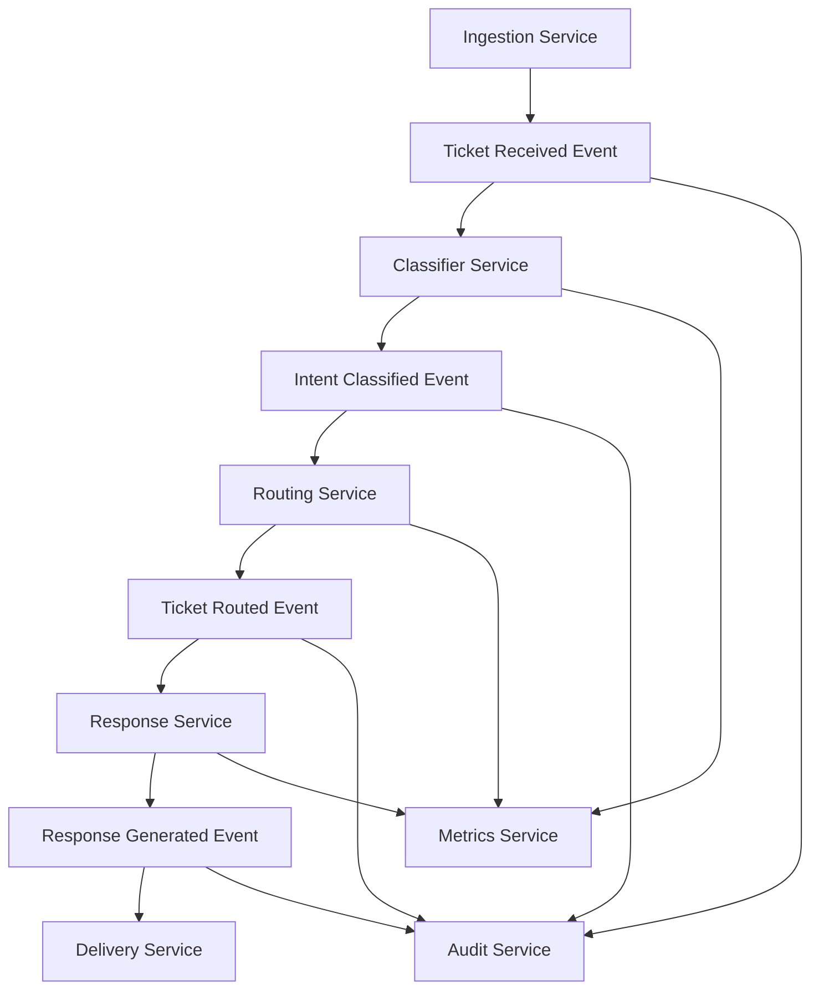

# Event-Driven Architecture Schemas

This directory contains comprehensive Zod schemas for the DIP (Deno Intelligence Platform) event-driven microservices architecture.

## Overview

The event system provides type-safe, validated events for the ticket processing pipeline and system operations. All events follow CloudEvents v1.0 specification with domain-specific data schemas.

## Architecture



## Key Features

### ✅ Comprehensive Schema Coverage

- **Ticket Domain**: Received, validated, updated, closed, escalated events
- **Classification Domain**: Intent classification, failure handling
- **Routing Domain**: Queue assignment, agent routing, escalation paths
- **Response Domain**: Generation, delivery, quality metrics
- **Knowledge Base**: Search, article suggestions, relevance scoring
- **System Events**: Health checks, errors, service lifecycle
- **Metrics**: Performance data, business intelligence
- **Audit**: Compliance logging, change tracking

### ✅ Production-Ready Features

- **Type Safety**: Full TypeScript integration with inferred types
- **Validation**: Comprehensive Zod schemas with detailed error reporting
- **Event Correlation**: Built-in correlation and causation tracking
- **Versioning Support**: Schema evolution with migration functions
- **Performance Optimized**: Sub-millisecond validation (avg 0.013ms)
- **CloudEvents Compliant**: Full v1.0 specification support

### ✅ Developer Experience

- **Event Builders**: Type-safe event creation functions
- **Validation Helpers**: Easy validation with detailed error messages
- **Examples**: Comprehensive usage patterns and workflows
- **Testing**: 17 comprehensive test cases with 100% pass rate
- **Documentation**: Best practices and evolution strategies

## Files Structure

```
shared/events/
├── base.ts              # TypedCloudEvent implementation
├── types.ts             # Event type constants and registry
├── schemas.ts           # Comprehensive Zod schemas (⭐ MAIN FILE)
├── examples.ts          # Usage patterns and workflows
├── validation-tests.ts  # Comprehensive test suite
├── best-practices.md    # Production guidelines
├── consumer.ts          # Event consumption utilities
├── publisher.ts         # Event publishing utilities
├── mod.ts              # Module exports
└── README.md           # This file
```

## Quick Start

### 1. Import the schemas and builders

```typescript
import {
  EventBuilders,
  EventMetadata,
  TicketReceivedEventSchema,
  validateEventData,
} from "@dip/shared/events";
```

### 2. Create type-safe events

```typescript
// Create a ticket received event
const ticketEvent = EventBuilders.ticketReceived({
  ticket: {
    id: "550e8400-e29b-41d4-a716-446655440000",
    subject: "Login Issue",
    description: "Cannot access my account",
    status: "new",
    priority: "high",
    channel: "email",
    customer: {
      email: "user@company.com",
      name: "John Doe",
      tier: "enterprise",
      language: "en",
    },
    created_at: new Date().toISOString(),
  },
  source_system: "email_gateway",
  received_at: new Date().toISOString(),
  metadata: {
    version: "1.0",
    environment: "production",
    tenantId: "tenant-123",
    priority: EventPriority.HIGH,
  },
});
```

### 3. Create event chains with correlation

```typescript
// Create classification event from ticket event
const classifiedEvent = ticketEvent.createResponse(
  EventTypes.INTENT_CLASSIFIED,
  {
    ticket_id: ticket.id,
    classification_result: {
      intent: "authentication_issue",
      confidence_score: 0.95,
      confidence_level: "very_high",
    },
    model_version: "v2.1.0",
    processing_time_ms: 150,
    classified_at: new Date().toISOString(),
    classifier_id: "nlp-classifier-001",
  },
);

// Events automatically maintain correlation chain
console.log(classifiedEvent.getCorrelationId()); // Same as ticketEvent
console.log(classifiedEvent.getCausationId()); // ticketEvent.id
```

### 4. Validate events

```typescript
// Validate event data
const validation = validateEventData(
  EventTypes.TICKET_RECEIVED,
  eventData,
);

if (validation.isValid) {
  console.log("Event is valid:", validation.validatedData);
} else {
  console.error("Validation errors:", validation.errors?.issues);
}
```

## Schema Highlights

### Ticket Schema

```typescript
{
  id: string (UUID),
  subject: string (1-200 chars),
  description: string (min 1 char),
  status: "new" | "open" | "pending" | "resolved" | "closed" | ...,
  priority: "low" | "medium" | "high" | "urgent" | "critical",
  channel: "email" | "chat" | "phone" | "api" | ...,
  customer: {
    email: string (email format),
    name: string (1-100 chars),
    tier: "free" | "basic" | "premium" | "enterprise",
    // ... additional fields
  },
  // ... timestamps, tags, attachments, etc.
}
```

### Classification Schema

```typescript
{
  intent: string,
  confidence_score: number (0-1),
  confidence_level: "low" | "medium" | "high" | "very_high",
  entities?: Array<{
    entity: string,
    value: string,
    confidence_score: number (0-1),
  }>,
  sentiment?: {
    polarity: "positive" | "negative" | "neutral",
    score: number (-1 to 1),
  },
  // ... additional classification data
}
```

### Event Metadata Schema

```typescript
{
  version: string (default: "1.0"),
  environment?: "development" | "staging" | "production" | "test",
  tenantId?: string (UUID),
  userId?: string (UUID),
  priority: EventPriority (default: MEDIUM),
  tags?: string[],
  // ... additional metadata
}
```

## Validation Features

- **Data Type Validation**: Ensures correct types (UUID, email, datetime, etc.)
- **Business Rule Validation**: Enforces domain constraints
- **Range Validation**: Confidence scores (0-1), priorities, etc.
- **Format Validation**: Email addresses, phone numbers, URLs
- **Custom Validation**: Domain-specific rules and relationships

## Performance Metrics

From validation tests:

- **Average Validation Time**: 0.013ms per event
- **Average Event Creation**: 0.008ms per event
- **Test Coverage**: 17 comprehensive test cases
- **Success Rate**: 100% (17/17 tests passing)

## Event Types Supported

### Core Business Events

- `com.dip.ticket.received` - New ticket ingestion
- `com.dip.ticket.validated` - Ticket validation results
- `com.dip.intent.classified` - ML classification results
- `com.dip.routing.routed` - Routing decisions
- `com.dip.response.generated` - Response creation

### System Events

- `com.dip.system.service.started` - Service lifecycle
- `com.dip.system.health.check` - Health monitoring
- `com.dip.system.error` - Error reporting

### Analytics Events

- `com.dip.metrics.collected` - Performance metrics
- `com.dip.audit.log.created` - Audit trail

## Versioning Strategy

The system supports schema evolution:

```typescript
// Register new schema version
versionedSchemas.registerVersion("com.dip.ticket.received", "2.0", {
  version: "2.0",
  schema: TicketReceivedEventV2Schema,
  migration: (v1Data) => ({
    ...v1Data,
    // Add new fields with defaults
    processing_hints: { urgent: false, auto_respond: true },
  }),
});

// Automatic migration to latest version
const migratedData = versionedSchemas.migrateToLatest(
  eventType,
  oldData,
  fromVersion,
);
```

## Error Handling

Comprehensive error information included in events:

```typescript
{
  error: {
    code: "ML_MODEL_TIMEOUT",
    message: "Classification request timed out",
    details: { endpoint: "...", timeout_seconds: 30 },
    retry_count: 2,
    max_retries: 3,
    next_retry_at: "2024-01-01T12:00:00Z"
  },
  severity: "medium",
  recovery_action: "Retry with fallback classifier"
}
```

## Best Practices

1. **Event Design**
   - Use business-meaningful events, not technical operations
   - Include complete context to avoid additional queries
   - Follow naming convention: `{org}.{domain}.{entity}.{action}`

2. **Schema Evolution**
   - Use semantic versioning (major.minor.patch)
   - Provide migration functions for breaking changes
   - Always include default values for new optional fields

3. **Performance**
   - Keep events lean but informative
   - Use partitioning keys for scalability
   - Implement circuit breakers for retry logic

4. **Security**
   - Avoid including PII in events
   - Use references (IDs) instead of sensitive data
   - Mark events with appropriate sensitivity levels

## Integration Examples

See [examples.ts](./examples.ts) for comprehensive usage patterns including:

- Basic event creation and validation
- Event chaining and correlation
- Error handling patterns
- Complex multi-service workflows
- Performance optimization
- Unicode and internationalization support

## Testing

Run the comprehensive test suite:

```bash
deno test shared/events/validation-tests.ts --allow-all
```

The test suite covers:

- Schema validation for all event types
- Field-level validation rules
- Event builder functionality
- Event correlation and causation
- Schema versioning and migration
- Performance benchmarks
- Edge cases and error conditions
- Unicode and special character support

---

This event schema system provides a robust foundation for the DIP platform's event-driven architecture, ensuring type safety, performance, and maintainability at scale.
